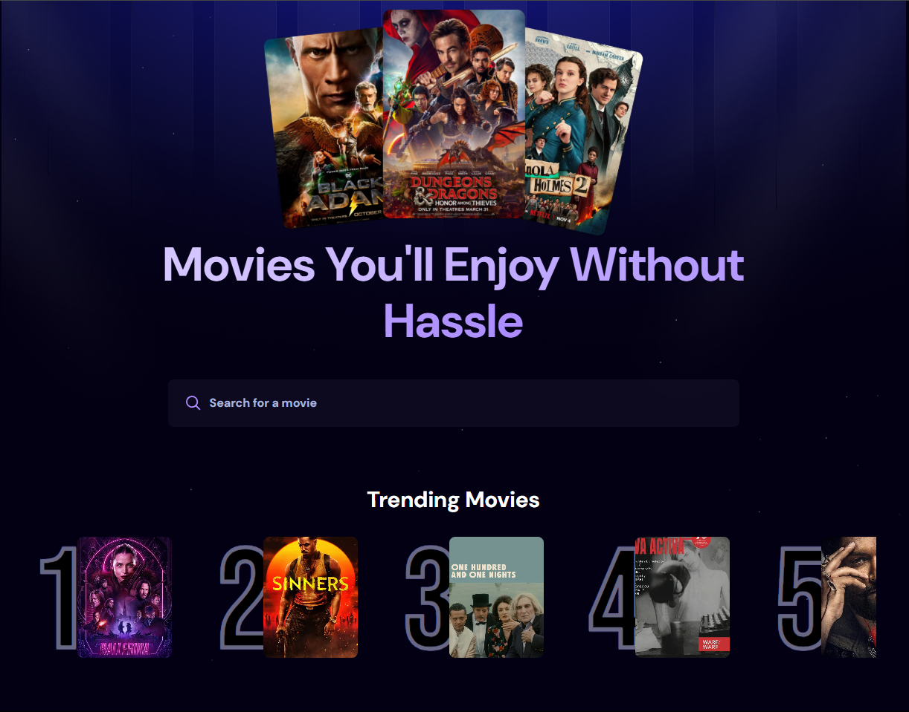

# 🎬 Movie App (2025)


A responsive **movie discovery web application** built with **React.js** and **Appwrite** backend.  
This app enables users to explore trending movies, search by genre or title, and view details in real time — all with smooth UI interactions and an optimized API-driven architecture.

🌐 **Live Demo:** [https://movie-app-sable-tau.vercel.app/](https://movie-app-sable-tau.vercel.app/)

---

## ✨ Features

- 🎞️ Real-time movie discovery using trending and search APIs  
- 🔍 Advanced filters for genre, rating, and release year  
- 🔐 Appwrite-powered authentication and user management  
- ⚡ Optimized REST API integration for dynamic updates  
- 💾 Content management through Appwrite’s backend console  
- 📱 Fully responsive design with TailwindCSS  

---

## 🧠 Learning Objectives

This project demonstrates:
- Building responsive React components with TailwindCSS  
- Managing state and API data using React hooks  
- Integrating **Appwrite** for authentication and backend services  
- Structuring modern single-page applications with modular design  

---

## ⚙️ Setup & Installation

1. **Clone the Repository**
   ```bash
   git clone https://github.com/yourusername/movie-app-2025.git
   cd movie-app-2025
   ```

2. **Install Dependencies**
   ```bash
   npm install
   ```

3. **Set Up Environment Variables**
   - Create a `.env` file in the project root and add your Appwrite credentials:
     ```bash
     VITE_APPWRITE_ENDPOINT=your_endpoint
     VITE_APPWRITE_PROJECT_ID=your_project_id
     VITE_APPWRITE_DATABASE_ID=your_database_id
     VITE_APPWRITE_COLLECTION_ID=your_collection_id
     ```

4. **Run the App Locally**
   ```bash
   npm run dev
   ```
   Then open [http://localhost:5173](http://localhost:5173) in your browser.

---

## 🖼️ Screenshots

| Home Page |
|------------|
|  |

> *(Replace with your own screenshots after uploading them to the `/assets` folder.)*

---

## 🧑‍💻 Author

**Ashis Wadhwani**  
📍 Developer & Designer of the project  
🔗 [GitHub Profile](https://github.com/ashis05)

---

## 📜 License

This project is licensed under the **MIT License** — you are free to use, modify, and distribute it with attribution.

See the [LICENSE](LICENSE) file for full details.

---

## 🚀 Future Enhancements
- Add user watchlists and favorites  
- Implement personalized movie recommendations  
- Integrate pagination and infinite scroll for large datasets  
- Add dark/light mode toggle  

---

### ⭐ If you like this project...
Give it a star on GitHub to support future updates!
